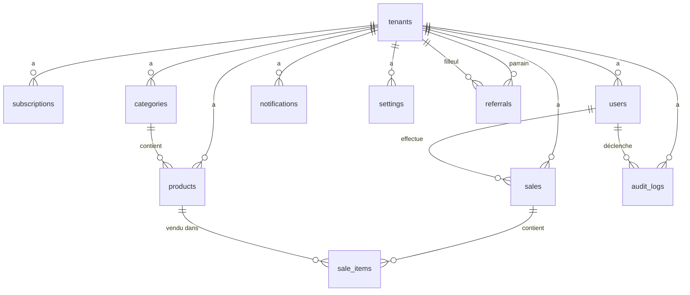

# 08 — Schéma de la Base de Données PostgreSQL

## 8.1 Diagramme Entité-Relation (Mermaid)



## 8.2 Scripts de création des tables

### 8.2.1 Table `tenants`

```sql
CREATE TABLE tenants (
    id UUID PRIMARY KEY DEFAULT gen_random_uuid(),
    name VARCHAR(100) NOT NULL,
    owner_name VARCHAR(80) NOT NULL,
    phone VARCHAR(20) UNIQUE NOT NULL,
    email VARCHAR(100),
    address TEXT,
    city VARCHAR(80),
    country VARCHAR(80),
    currency VARCHAR(10) NOT NULL DEFAULT 'FCFA',
    logo_url VARCHAR(255),
    slogan VARCHAR(200),
    tax_number VARCHAR(50),
    timezone VARCHAR(50) DEFAULT 'Africa/Lome',
    referral_code VARCHAR(30) UNIQUE NOT NULL,
    is_active BOOLEAN NOT NULL DEFAULT TRUE,
    onboarding_completed BOOLEAN NOT NULL DEFAULT FALSE,
    created_at TIMESTAMP WITH TIME ZONE NOT NULL DEFAULT CURRENT_TIMESTAMP,
    updated_at TIMESTAMP WITH TIME ZONE NOT NULL DEFAULT CURRENT_TIMESTAMP
);

CREATE INDEX idx_tenants_phone ON tenants(phone);
CREATE INDEX idx_tenants_referral_code ON tenants(referral_code);
```

### 8.2.2 Table `subscriptions`

```sql
CREATE TABLE subscriptions (
    id UUID PRIMARY KEY DEFAULT gen_random_uuid(),
    tenant_id UUID NOT NULL REFERENCES tenants(id) ON DELETE CASCADE,
    tier VARCHAR(10) NOT NULL DEFAULT 'FREE' CHECK (tier IN ('FREE', 'PRO')),
    billing_type VARCHAR(15) CHECK (billing_type IN ('MONTHLY', 'LIFETIME', NULL)),
    status VARCHAR(15) NOT NULL DEFAULT 'ACTIVE' CHECK (status IN ('ACTIVE', 'EXPIRED', 'CANCELLED')),
    start_date TIMESTAMP WITH TIME ZONE NOT NULL DEFAULT CURRENT_TIMESTAMP,
    end_date TIMESTAMP WITH TIME ZONE, -- NULL = illimité (FREE ou LIFETIME)
    activated_by UUID REFERENCES users(id), -- NULL = auto, sinon = SUPERADMIN qui a activé
    activation_method VARCHAR(15) DEFAULT 'AUTO' CHECK (activation_method IN ('AUTO', 'MANUAL', 'FEDAPAY', 'REFERRAL')),
    created_at TIMESTAMP WITH TIME ZONE NOT NULL DEFAULT CURRENT_TIMESTAMP,
    updated_at TIMESTAMP WITH TIME ZONE NOT NULL DEFAULT CURRENT_TIMESTAMP
);

CREATE INDEX idx_subscriptions_tenant ON subscriptions(tenant_id);
CREATE INDEX idx_subscriptions_status ON subscriptions(status);
```

### 8.2.3 Table `users`

```sql
CREATE TABLE users (
    id UUID PRIMARY KEY DEFAULT gen_random_uuid(),
    tenant_id UUID NOT NULL REFERENCES tenants(id) ON DELETE CASCADE,
    username VARCHAR(80) UNIQUE NOT NULL,
    password_hash VARCHAR(255) NOT NULL,
    role VARCHAR(15) NOT NULL CHECK (role IN ('SUPERADMIN', 'ADMIN', 'SELLER')),
    display_name VARCHAR(80),
    is_active BOOLEAN NOT NULL DEFAULT TRUE,
    last_login_at TIMESTAMP WITH TIME ZONE,
    last_login_ip VARCHAR(45),
    created_at TIMESTAMP WITH TIME ZONE NOT NULL DEFAULT CURRENT_TIMESTAMP,
    updated_at TIMESTAMP WITH TIME ZONE NOT NULL DEFAULT CURRENT_TIMESTAMP
);

CREATE INDEX idx_users_tenant ON users(tenant_id);
CREATE INDEX idx_users_username ON users(username);
CREATE INDEX idx_users_role ON users(role);
```

### 8.2.4 Table `categories`

```sql
CREATE TABLE categories (
    id UUID PRIMARY KEY DEFAULT gen_random_uuid(),
    tenant_id UUID NOT NULL REFERENCES tenants(id) ON DELETE CASCADE,
    name VARCHAR(80) NOT NULL,
    icon VARCHAR(50), -- Nom de l'icône (optionnel)
    is_default BOOLEAN NOT NULL DEFAULT FALSE, -- Catégorie prédéfinie vs personnalisée
    sort_order INTEGER DEFAULT 0,
    created_at TIMESTAMP WITH TIME ZONE NOT NULL DEFAULT CURRENT_TIMESTAMP,

    UNIQUE(tenant_id, name) -- Pas de doublon de catégorie dans la même boutique
);

CREATE INDEX idx_categories_tenant ON categories(tenant_id);
```

### 8.2.5 Table `products`

```sql
CREATE TABLE products (
    id UUID PRIMARY KEY DEFAULT gen_random_uuid(),
    tenant_id UUID NOT NULL REFERENCES tenants(id) ON DELETE CASCADE,
    category_id UUID REFERENCES categories(id) ON DELETE SET NULL,
    name VARCHAR(150) NOT NULL,
    sku VARCHAR(50),
    purchase_price DECIMAL(12, 2) NOT NULL CHECK (purchase_price > 0),
    sell_price DECIMAL(12, 2) NOT NULL CHECK (sell_price > 0),
    stock_quantity INTEGER NOT NULL DEFAULT 0 CHECK (stock_quantity >= 0),
    stock_threshold INTEGER, -- NULL = utiliser le seuil global
    image_url VARCHAR(255),
    description TEXT,
    has_expiry BOOLEAN NOT NULL DEFAULT FALSE,
    expiry_date DATE, -- Requis si has_expiry = true
    is_deleted BOOLEAN NOT NULL DEFAULT FALSE,
    deleted_at TIMESTAMP WITH TIME ZONE,
    created_at TIMESTAMP WITH TIME ZONE NOT NULL DEFAULT CURRENT_TIMESTAMP,
    updated_at TIMESTAMP WITH TIME ZONE NOT NULL DEFAULT CURRENT_TIMESTAMP,

    UNIQUE(tenant_id, sku), -- SKU unique par boutique
    CHECK (sell_price >= purchase_price),
    CHECK (NOT has_expiry OR expiry_date IS NOT NULL) -- Si périssable, date obligatoire
);

CREATE INDEX idx_products_tenant ON products(tenant_id);
CREATE INDEX idx_products_category ON products(category_id);
CREATE INDEX idx_products_deleted ON products(is_deleted);
CREATE INDEX idx_products_sku ON products(tenant_id, sku);
CREATE INDEX idx_products_stock_alert ON products(tenant_id, stock_quantity, stock_threshold)
    WHERE is_deleted = FALSE;
```

### 8.2.6 Table `sales`

```sql
CREATE TABLE sales (
    id UUID PRIMARY KEY DEFAULT gen_random_uuid(),
    tenant_id UUID NOT NULL REFERENCES tenants(id) ON DELETE CASCADE,
    seller_id UUID NOT NULL REFERENCES users(id),
    transaction_number VARCHAR(30) NOT NULL, -- Format: VENTE-YYYY-NNNNNNN
    payment_method VARCHAR(20) NOT NULL CHECK (payment_method IN ('CASH', 'MOBILE_MONEY')),
    momo_reference VARCHAR(100), -- Obligatoire si payment_method = 'MOBILE_MONEY'
    subtotal DECIMAL(12, 2) NOT NULL,
    discount_amount DECIMAL(12, 2) NOT NULL DEFAULT 0,
    discount_type VARCHAR(10) CHECK (discount_type IN ('FIXED', 'PERCENTAGE', NULL)),
    discount_percentage DECIMAL(5, 2), -- Pourcentage de remise si applicable
    total_amount DECIMAL(12, 2) NOT NULL,
    profit_estimate DECIMAL(12, 2), -- Bénéfice estimé sur la vente
    amount_received DECIMAL(12, 2), -- Montant reçu (pour calcul de monnaie, espèces)
    change_given DECIMAL(12, 2), -- Monnaie rendue
    is_cancelled BOOLEAN NOT NULL DEFAULT FALSE,
    cancelled_at TIMESTAMP WITH TIME ZONE,
    cancelled_by UUID REFERENCES users(id),
    created_at TIMESTAMP WITH TIME ZONE NOT NULL DEFAULT CURRENT_TIMESTAMP,

    UNIQUE(tenant_id, transaction_number),
    CHECK (payment_method != 'MOBILE_MONEY' OR momo_reference IS NOT NULL)
);

CREATE INDEX idx_sales_tenant ON sales(tenant_id);
CREATE INDEX idx_sales_seller ON sales(seller_id);
CREATE INDEX idx_sales_date ON sales(tenant_id, created_at);
CREATE INDEX idx_sales_cancelled ON sales(is_cancelled);
CREATE INDEX idx_sales_daily_count ON sales(tenant_id, created_at)
    WHERE is_cancelled = FALSE;
```

### 8.2.7 Table `sale_items`

```sql
CREATE TABLE sale_items (
    id UUID PRIMARY KEY DEFAULT gen_random_uuid(),
    sale_id UUID NOT NULL REFERENCES sales(id) ON DELETE CASCADE,
    product_id UUID REFERENCES products(id) ON DELETE SET NULL,
    product_name VARCHAR(150) NOT NULL, -- Snapshot du nom au moment de la vente
    quantity INTEGER NOT NULL CHECK (quantity > 0),
    unit_purchase_price DECIMAL(12, 2) NOT NULL, -- Snapshot du prix d'achat
    unit_sell_price DECIMAL(12, 2) NOT NULL, -- Snapshot du prix de vente
    total_price DECIMAL(12, 2) NOT NULL,
    profit DECIMAL(12, 2) -- (sell_price - purchase_price) * quantity
);

CREATE INDEX idx_sale_items_sale ON sale_items(sale_id);
CREATE INDEX idx_sale_items_product ON sale_items(product_id);
```

### 8.2.8 Table `audit_logs`

```sql
CREATE TABLE audit_logs (
    id UUID PRIMARY KEY DEFAULT gen_random_uuid(),
    tenant_id UUID REFERENCES tenants(id) ON DELETE CASCADE, -- NULL pour les actions SUPERADMIN
    user_id UUID REFERENCES users(id) ON DELETE SET NULL,
    username VARCHAR(80), -- Snapshot du username au moment de l'action
    user_role VARCHAR(15), -- Snapshot du rôle
    action VARCHAR(50) NOT NULL,
    entity_type VARCHAR(30), -- 'PRODUCT', 'SALE', 'USER', 'TENANT', 'SETTINGS', etc.
    entity_id UUID, -- ID de l'entité concernée
    details JSONB NOT NULL DEFAULT '{}',
    ip_address VARCHAR(45),
    user_agent TEXT,
    created_at TIMESTAMP WITH TIME ZONE NOT NULL DEFAULT CURRENT_TIMESTAMP
);

CREATE INDEX idx_audit_tenant ON audit_logs(tenant_id);
CREATE INDEX idx_audit_user ON audit_logs(user_id);
CREATE INDEX idx_audit_action ON audit_logs(action);
CREATE INDEX idx_audit_date ON audit_logs(tenant_id, created_at);
CREATE INDEX idx_audit_entity ON audit_logs(entity_type, entity_id);
```

### 8.2.9 Table `notifications`

```sql
CREATE TABLE notifications (
    id UUID PRIMARY KEY DEFAULT gen_random_uuid(),
    tenant_id UUID NOT NULL REFERENCES tenants(id) ON DELETE CASCADE,
    user_id UUID REFERENCES users(id) ON DELETE CASCADE, -- NULL = notification pour tous les ADMIN du tenant
    type VARCHAR(30) NOT NULL, -- 'STOCK_LOW', 'SUBSCRIPTION_EXPIRING', 'REFERRAL_COMPLETED', 'SECURITY_ALERT'
    title VARCHAR(150) NOT NULL,
    message TEXT NOT NULL,
    data JSONB, -- Données supplémentaires (ex: product_id pour STOCK_LOW)
    is_read BOOLEAN NOT NULL DEFAULT FALSE,
    read_at TIMESTAMP WITH TIME ZONE,
    created_at TIMESTAMP WITH TIME ZONE NOT NULL DEFAULT CURRENT_TIMESTAMP
);

CREATE INDEX idx_notifications_tenant ON notifications(tenant_id);
CREATE INDEX idx_notifications_user ON notifications(user_id);
CREATE INDEX idx_notifications_unread ON notifications(tenant_id, is_read) WHERE is_read = FALSE;
```

### 8.2.10 Table `referrals`

```sql
CREATE TABLE referrals (
    id UUID PRIMARY KEY DEFAULT gen_random_uuid(),
    referrer_tenant_id UUID NOT NULL REFERENCES tenants(id) ON DELETE CASCADE,
    referred_tenant_id UUID NOT NULL REFERENCES tenants(id) ON DELETE CASCADE,
    status VARCHAR(15) NOT NULL DEFAULT 'PENDING' CHECK (status IN ('PENDING', 'COMPLETED', 'REWARDED')),
    completed_at TIMESTAMP WITH TIME ZONE, -- Date où le filleul est passé PRO
    rewarded_at TIMESTAMP WITH TIME ZONE, -- Date où la récompense a été attribuée au parrain
    created_at TIMESTAMP WITH TIME ZONE NOT NULL DEFAULT CURRENT_TIMESTAMP,

    UNIQUE(referred_tenant_id) -- Un filleul ne peut avoir qu'un seul parrain
);

CREATE INDEX idx_referrals_referrer ON referrals(referrer_tenant_id);
CREATE INDEX idx_referrals_status ON referrals(referrer_tenant_id, status);
```

### 8.2.11 Table `settings`

```sql
CREATE TABLE settings (
    id UUID PRIMARY KEY DEFAULT gen_random_uuid(),
    tenant_id UUID UNIQUE NOT NULL REFERENCES tenants(id) ON DELETE CASCADE,
    global_stock_threshold INTEGER NOT NULL DEFAULT 20,
    max_seller_discount_percentage DECIMAL(5, 2) NOT NULL DEFAULT 20.00,
    ticket_show_logo BOOLEAN NOT NULL DEFAULT FALSE,
    ticket_show_slogan BOOLEAN NOT NULL DEFAULT FALSE,
    ticket_footer_message VARCHAR(200) DEFAULT 'Merci pour votre achat !',
    ticket_width VARCHAR(10) DEFAULT '80mm' CHECK (ticket_width IN ('58mm', '80mm')),
    ticket_show_qr BOOLEAN NOT NULL DEFAULT FALSE,
    theme VARCHAR(10) NOT NULL DEFAULT 'dark' CHECK (theme IN ('dark', 'light')),
    created_at TIMESTAMP WITH TIME ZONE NOT NULL DEFAULT CURRENT_TIMESTAMP,
    updated_at TIMESTAMP WITH TIME ZONE NOT NULL DEFAULT CURRENT_TIMESTAMP
);
```

### 8.2.12 Table `daily_sale_counts` (Performance)

```sql
-- Table de cache pour le comptage rapide des ventes journalières (FREE plan)
CREATE TABLE daily_sale_counts (
    id UUID PRIMARY KEY DEFAULT gen_random_uuid(),
    tenant_id UUID NOT NULL REFERENCES tenants(id) ON DELETE CASCADE,
    sale_date DATE NOT NULL DEFAULT CURRENT_DATE,
    count INTEGER NOT NULL DEFAULT 0,

    UNIQUE(tenant_id, sale_date)
);

CREATE INDEX idx_daily_sales_tenant_date ON daily_sale_counts(tenant_id, sale_date);
```

## 8.3 Triggers recommandés

```sql
-- Trigger pour mettre à jour updated_at automatiquement
CREATE OR REPLACE FUNCTION update_updated_at()
RETURNS TRIGGER AS $$
BEGIN
    NEW.updated_at = CURRENT_TIMESTAMP;
    RETURN NEW;
END;
$$ LANGUAGE plpgsql;

CREATE TRIGGER trg_tenants_updated_at BEFORE UPDATE ON tenants FOR EACH ROW EXECUTE FUNCTION update_updated_at();
CREATE TRIGGER trg_users_updated_at BEFORE UPDATE ON users FOR EACH ROW EXECUTE FUNCTION update_updated_at();
CREATE TRIGGER trg_products_updated_at BEFORE UPDATE ON products FOR EACH ROW EXECUTE FUNCTION update_updated_at();
CREATE TRIGGER trg_subscriptions_updated_at BEFORE UPDATE ON subscriptions FOR EACH ROW EXECUTE FUNCTION update_updated_at();
CREATE TRIGGER trg_settings_updated_at BEFORE UPDATE ON settings FOR EACH ROW EXECUTE FUNCTION update_updated_at();
```
