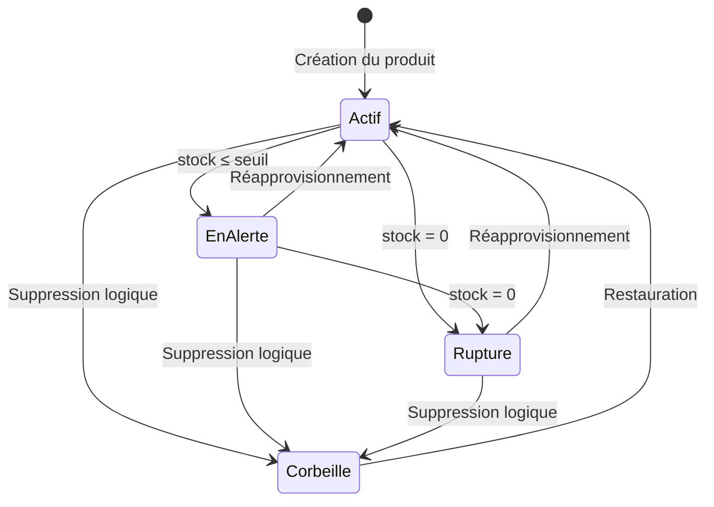

# 11 — Module Produits — Spécifications Complètes

Ce fichier complète et détaille le §3.3 du Cahier des Charges.

## 11.1 Cycle de vie d'un produit

## 11.2 Comportement UX de la date de péremption

C'est un détail d'ergonomie important défini dans la conversation :

1. Par défaut, la case "Produit périssable" est **décochée**.
2. La section de date de péremption (label + input date) est **complètement grisée** :
   - `opacity: 0.4`
   - `pointer-events: none`
   - Curseur `not-allowed`
3. Quand l'utilisateur coche "Produit périssable" :
   - La section se **dégrise avec une animation CSS** fluide (`transition: opacity 0.3s ease`).
   - Le champ date devient **actif et obligatoire**.
   - Le label change de couleur pour indiquer qu'il est actif.
4. Si la case est décochée à nouveau :
   - La section se grise de nouveau.
   - La valeur du champ date est effacée.

## 11.3 Upload de photo produit

- Formats acceptés : JPEG, PNG, WebP.
- Taille maximale : 2 Mo.
- La photo est uploadée via `multipart/form-data`.
- Côté serveur, la photo est redimensionnée à 400x400px max (pour optimiser le chargement POS).
- La photo est stockée sur le disque dans `uploads/products/[tenant_id]/[product_id].[ext]`.
- L'URL relative est stockée en base dans `products.image_url`.

## 11.4 Génération automatique du SKU

Si le champ SKU est laissé vide :
- Le système génère automatiquement un SKU au format `SKU-XXXXXX` (6 caractères alphanumériques aléatoires en majuscules).
- Le système vérifie l'unicité du SKU au sein du tenant avant de valider.

## 11.5 Catégories personnalisées (PRO uniquement)

- Les utilisateurs FREE ne voient que les catégories prédéfinies + "Autres".
- Les utilisateurs PRO peuvent créer, renommer et supprimer des catégories personnalisées.
- La suppression d'une catégorie déplace tous ses produits dans "Autres".
