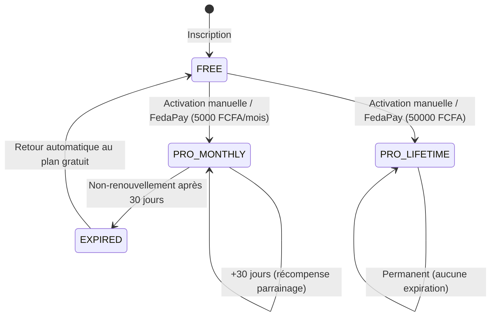

# 14 — Module Abonnements — Spécifications Complètes

## 14.1 Comparaison des plans

| Fonctionnalité | FREE | PRO (5 000 FCFA/mois ou 50 000 FCFA lifetime) |
|:---------------|:-----|:-----------------------------------------------|
| Ventes par jour | 30 max | Illimité |
| Produits | Illimité | Illimité |
| Vendeurs | Illimité | Illimité |
| Dashboard & graphiques | ✅ | ✅ |
| Logs d'audit | ✅ | ✅ |
| Notifications | ✅ | ✅ |
| Personnalisation tickets (logo, slogan, QR) | ❌ | ✅ |
| Exports PDF/Excel | ❌ | ✅ |
| Catégories personnalisées | ❌ | ✅ |
| Support prioritaire | ❌ | ✅ |

## 14.2 Cycle de vie d'un abonnement



## 14.3 Activation manuelle (Phase 1)

1. L'utilisateur voit sa page d'abonnement avec son plan actuel et les options PRO.
2. Les coordonnées de contact du Super Administrateur sont affichées (téléphone, WhatsApp, email).
3. L'utilisateur contacte le Super Admin et effectue le paiement hors plateforme.
4. Le Super Admin se connecte au panel admin (`/admin/subscriptions`).
5. Il recherche la boutique et clique sur "Activer PRO".
6. Il choisit le type : Mensuel ou Lifetime.
7. Le système crée/met à jour l'enregistrement dans `subscriptions`.
8. Un log `SUBSCRIPTION_ACTIVATED` est créé.
9. Une notification est envoyée au gérant : "Votre abonnement PRO a été activé !"

## 14.4 Architecture prête pour FedaPay (Phase 2)

Le code est structuré avec un service abstrait :

```typescript
// services/payment.service.ts
interface PaymentService {
  createPayment(amount: number, currency: string, description: string): Promise<PaymentResult>;
  verifyPayment(transactionId: string): Promise<PaymentStatus>;
  handleWebhook(payload: any): Promise<void>;
}

// Implémentation future
class FedaPayService implements PaymentService { ... }

// Implémentation actuelle
class ManualPaymentService implements PaymentService { ... }
```

## 14.5 Expiration et rétrogradation

- Quand un abonnement PRO mensuel expire (`end_date < NOW()`), le système :
  1. Passe le statut à `EXPIRED`.
  2. Crée un log `SUBSCRIPTION_EXPIRED`.
  3. Envoie une notification au gérant.
  4. L'utilisateur est automatiquement rétrogradé en FREE (la limite de 30 ventes/jour s'applique immédiatement).
- Notifications d'expiration imminente envoyées à J-7, J-3 et J-1.
