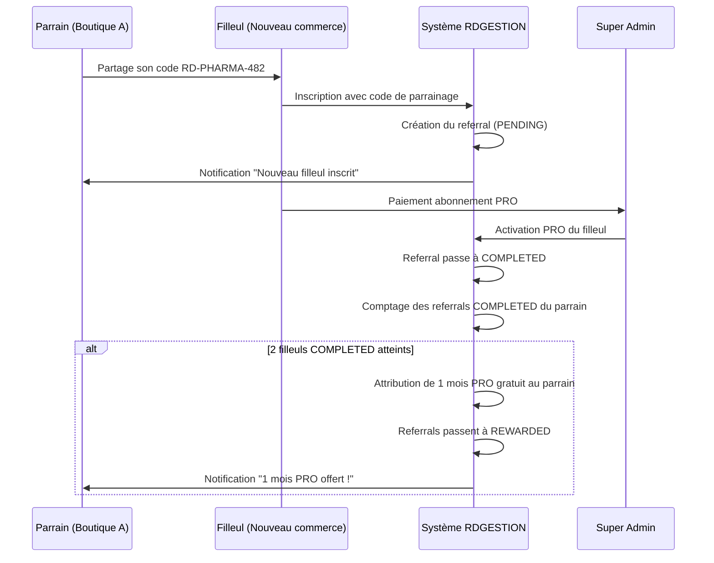

# 15 — Module Parrainage — Spécifications Complètes

## 15.1 Génération du code de parrainage

- À la création de chaque tenant, un code de parrainage unique est généré.
- Format : `RD-[NOM_BOUTIQUE_NORMALISÉ]-[3_CHIFFRES]`
  - `NOM_BOUTIQUE_NORMALISÉ` : Nom de la boutique en majuscules, sans espaces ni caractères spéciaux, tronqué à 10 caractères.
  - `3_CHIFFRES` : Nombre aléatoire entre 100 et 999.
- Exemples : `RD-PHARMA-482`, `RD-BOUTIQUE-731`, `RD-RESTAU-205`
- Le code est vérifié unique en base avant insertion.

## 15.2 Flux complet du parrainage

## 15.3 Règles métier du parrainage

1. Un filleul ne peut avoir qu'**un seul** parrain (contrainte UNIQUE sur `referred_tenant_id`).
2. Le parrainage est `PENDING` jusqu'à ce que le filleul souscrive un abonnement PRO **payant**.
3. Les parrainages `PENDING` ne comptent pas pour la récompense.
4. Quand **2 parrainages passent à `COMPLETED`**, le système :
   - Prolonge l'abonnement du parrain de **30 jours**.
   - Passe les 2 referrals à `REWARDED`.
   - Crée un log `REFERRAL_REWARD_GRANTED`.
   - Envoie une notification au parrain.
5. Le programme de parrainage peut être activé/désactivé par le Super Admin avec des dates de début et de fin.
6. Si le programme est désactivé, les codes de parrainage restent visibles mais ne sont plus acceptés à l'inscription.
